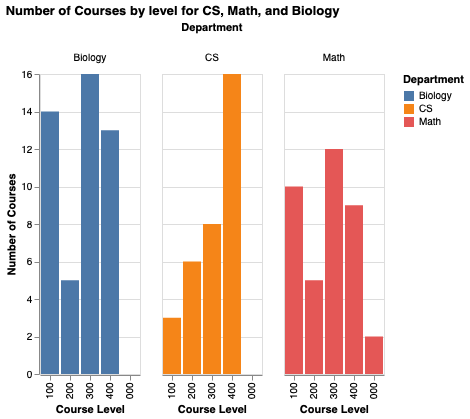

# CS200 Final Project: Hood College Course Catalog Analysis

This project analyzes the **2024–2025 Hood College course catalog** across three departments:  
**Computer Science (CS)**, **Mathematics (Math)**, and **Biology (Bio)**.

##  Abstract

This project explores curriculum trends at Hood College by scraping and analyzing undergraduate course data from the official catalog. I focused on three departments—Computer Science, Mathematics, and Biology—to answer key questions about course structure, content emphasis, and scheduling. Using Python for web scraping, text analysis, and visualization, the project reveals how departments differ in the number of advanced courses they offer, their thematic focuses, and seasonal availability of classes.

## Research Questions

1. **Which departments offer more advanced (300/400-level) courses?**  
2. **What topics are most frequently mentioned in course descriptions?**  
3. **How are courses distributed across semesters (Fall, Spring, etc.)?**

## Methods

###  Data Collection

Course data was scraped from:

- [CS Department](https://hood.smartcatalogiq.com/2024-2025/hood-college-2024-2025-catalog/undergraduate-courses/cs-computer-science/)
- [Math Department](https://hood.smartcatalogiq.com/2024-2025/hood-college-2024-2025-catalog/undergraduate-courses/math-mathematics/)
- [Biology Department](https://hood.smartcatalogiq.com/2024-2025/hood-college-2024-2025-catalog/undergraduate-courses/biol-biology/)

Each course entry includes:
- Department
- Course code & title
- Description
- Number of credits
- Semester(s) offered

### Data Cleaning

- Extracted structured fields from raw HTML using `BeautifulSoup`
- Cleaned course descriptions, titles, and credit values using `pandas` and `regex`
- Created department-specific stop word lists to filter out academic boilerplate

###  Analysis & Visualization

- **Altair**: Bar chart of course levels  
- **WordCloud**: Most common keywords by department  
- **Seaborn**: Course offerings by semester  
- `collections.Counter`: Top word frequencies by department

##  Findings

  

This chart compares the number of 100–400 level courses across Biology, CS, and Math.

### Course Level Distribution

| Department | Most Courses at Level |
|------------|------------------------|
| CS         | 300-level              |
| Biology    | 400-level              |
| Math       | Balanced (100–300)     |

> CS emphasizes technical depth. Biology leans into advanced, lab-intensive coursework.

---

### Keyword Emphasis (Top Word Cloud Insights)

- **CS**: design, data, systems, algorithms  
- **Math**: theory, equations, problem, functions  
- **Biology**: ecology, genetics, molecular, human

> Each department has a distinct academic language reflecting its focus.

---

###  Semester Distribution

  

| Department | Notable Offering Trends                         |
|------------|--------------------------------------------------|
| CS         | Focus on Spring and Either Semester             |
| Math       | Uniform distribution across Fall and Spring     |
| Biology    | Widest offering variety (Fall, Spring, Both)    |

> Biology offers the most flexible course schedule.

## How to Run

1. Clone the repository
2. Open `CS200 final project.ipynb` in Google Colab or Jupyter
3. Run all cells to fetch, clean, and analyze the data

---

## Ethical Considerations

- **Bias**: Descriptions may not fully reflect course content or difficulty  
- **Data Scope**: This reflects only one academic year  
- **Stop Words**: Some keywords might still carry academic noise despite filtering

